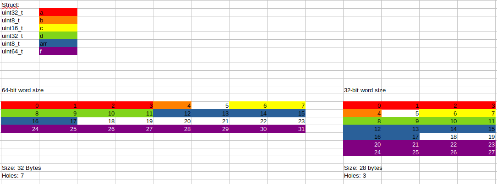

## C/C++ Struct Memory Layout Visualization

A basic example of a C struct, and how the memory layout differs between 32-bit and 64-bit word size.

```cpp
struct test_struct_t {
    uint32_t a;
    uint8_t b;
    uint16_t c;
    uint32_t d;
    uint8_t arr[6];
    uint64_t f;
};
```
(see `test.cpp`)

## Makefile
- `make 64-bit`
    - `g++ -g test.cpp -c -o test-64.o`
- `make 32-bit`
    - `g++ -g test.cpp -c -m32 -o test-32.o`


## Using [pahole ("Poke-a-hole")](https://lwn.net/Articles/335942/) to print memory layout

- `make print-struct-64`
    - `pahole -C test_struct_t test-64.o`
```die__process_class: tag not supported 0x2f (template_type_parameter)!
struct test_struct_t {
        uint32_t                   a;                    /*     0     4 */
        uint8_t                    b;                    /*     4     1 */

        /* XXX 1 byte hole, try to pack */

        uint16_t                   c;                    /*     6     2 */
        uint32_t                   d;                    /*     8     4 */
        uint8_t                    arr[6];               /*    12     6 */

        /* XXX 6 bytes hole, try to pack */

        uint64_t                   f;                    /*    24     8 */

        /* size: 32, cachelines: 1, members: 6 */
        /* sum members: 25, holes: 2, sum holes: 7 */
        /* last cacheline: 32 bytes */
};
```
- `make print-struct-32`
    - `pahole -C test_struct_t test-32.o`
```pahole -C test_struct_t test-32.o
die__process_class: tag not supported 0x2f (template_type_parameter)!
struct test_struct_t {
        uint32_t                   a;                    /*     0     4 */
        uint8_t                    b;                    /*     4     1 */

        /* XXX 1 byte hole, try to pack */

        uint16_t                   c;                    /*     6     2 */
        uint32_t                   d;                    /*     8     4 */
        uint8_t                    arr[6];               /*    12     6 */

        /* XXX 2 bytes hole, try to pack */

        uint64_t                   f;                    /*    20     8 */

        /* size: 28, cachelines: 1, members: 6 */
        /* sum members: 25, holes: 2, sum holes: 3 */
        /* last cacheline: 28 bytes */
};
```

## Visual
